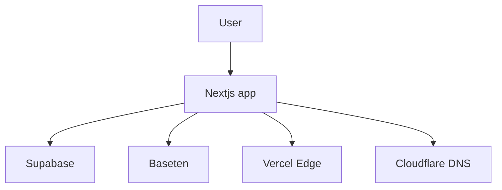
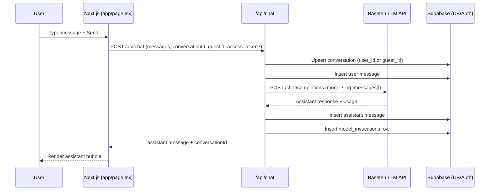

This project is a Baseten-powered ChatGPT-style interface. It demonstrates:

- **Baseten** for LLM inference via OpenAI-compatible APIs
- **Supabase** for Postgres, Auth (Google + guests), and metrics storage
- **Next.js (React, App Router) + Tailwind CSS** for the frontend
- **Vercel** for hosting, with `chat.matthew-tran.com` on Cloudflare DNS

The app supports:

- **Unauthenticated guests** with a local `guest_id`
- **Google-authenticated users** with persistent chat history
- Logging of **model invocations** for future Baseten vs other LLM comparisons

## Getting Started

### Prerequisites

- Node.js and npm installed
- Accounts on Baseten, Supabase, Vercel, Google Cloud, and Cloudflare

### Local setup

1. Install dependencies:

```bash
npm install
```

2. Create `.env.local` in the project root (not committed to git):

```bash
NEXT_PUBLIC_SUPABASE_URL=...
NEXT_PUBLIC_SUPABASE_ANON_KEY=...
SUPABASE_SERVICE_ROLE_KEY=...
SUPABASE_DB_URL=...
NEXT_PUBLIC_SITE_URL=https://chat-matthew-tran.vercel.app

BASETEN_API_KEY=...
BASETEN_MODEL_SLUG=deepseek-ai/DeepSeek-V3-0324
```

3. Ensure the Supabase database has been migrated. The schema is stored in:

- `db/migrations/001_init.sql`

You can either:

- Run the SQL in the Supabase SQL editor, **or**
- Use the local migration helper:

```bash
npm run db:migrate
```

4. Start the dev server:

```bash
npm run dev
```

Then open [http://localhost:3000](http://localhost:3000).

Sign in with Google from the header to test authenticated mode, or stay as a
guest to test anonymous chats.

## Architecture

### High-level system diagram



### Request flow: chat completion



## Data model

Defined in `db/migrations/001_init.sql`:

- **conversations**
  - `id` (uuid, PK)
  - `user_id` (uuid, nullable, FK → `auth.users.id`)
  - `guest_id` (text, nullable)
  - `created_at` (timestamptz)
  - `title` (text)

- **messages**
  - `id` (uuid, PK)
  - `conversation_id` (uuid, FK → conversations.id, cascade on delete)
  - `role` (`user | assistant | system`)
  - `content` (text)
  - `created_at` (timestamptz)

- **model_invocations**
  - `id` (uuid, PK)
  - `conversation_id` (uuid, nullable FK)
  - `provider` (text, e.g. `baseten`)
  - `model` (text, e.g. `deepseek-ai/DeepSeek-V3-0324`)
  - `latency_ms` (int)
  - `input_tokens`, `output_tokens`, `total_tokens` (int)
  - `estimated_cost_usd` (numeric)
  - `created_at` (timestamptz)

## Secret management

### Local development

- All sensitive values live in `.env.local` and are **git-ignored** via `.gitignore` (`.env*`).
- Never commit API keys or connection strings.
- Keep `.env.local` in your password manager or as a secure note if needed.

### Vercel

In the Vercel project settings, configure the same keys as environment variables:

- `NEXT_PUBLIC_SUPABASE_URL`
- `NEXT_PUBLIC_SUPABASE_ANON_KEY`
- `SUPABASE_SERVICE_ROLE_KEY`
- `SUPABASE_DB_URL` (if you run migrations in CI or Vercel functions)
- `NEXT_PUBLIC_SITE_URL=https://chat.matthew-tran.com` (or the Vercel URL)
- `BASETEN_API_KEY`
- `BASETEN_MODEL_SLUG`

Do **not** put secrets into `next.config.ts` or committed files; only use env vars.

### Supabase & Google

- Supabase Auth uses the **Google OAuth client ID/secret** you created in
  Google Cloud; those are stored only inside Supabase, not in this repo.
- Redirect URLs are restricted to:
  - `http://localhost:3000`
  - `https://chat-matthew-tran.vercel.app`
  - `https://chat.matthew-tran.com`

## Deployment

1. **GitHub → Vercel**
   - The repo `matthewhaotran/chat-matthew-tran` is connected to Vercel.
   - Every push to `main` triggers a new deployment.

2. **Custom domain**
   - In Vercel project settings, add `chat.matthew-tran.com` as a domain.
   - In Cloudflare DNS for `matthew-tran.com`, create a CNAME:
     - Name: `chat`
     - Target: your Vercel domain (e.g. `chat-matthew-tran.vercel.app`)
   - Once DNS propagates, Vercel will issue TLS and the app will be available at
     `https://chat.matthew-tran.com`.

## Future work (metrics dashboard)

With `model_invocations` already capturing metrics per request, a future
iteration can add:

- A `/metrics` or `/dashboard` route.
- Aggregations by model/provider (Baseten vs other LLMs).
- Visualizations (latency distribution, token usage, cost estimates) using
  Supabase queries or an embedded BI tool.

This will complete the story of **evaluating Baseten vs alternatives** in a
realistic, production-like chat application.

This is a [Next.js](https://nextjs.org) project bootstrapped with [`create-next-app`](https://nextjs.org/docs/app/api-reference/cli/create-next-app).